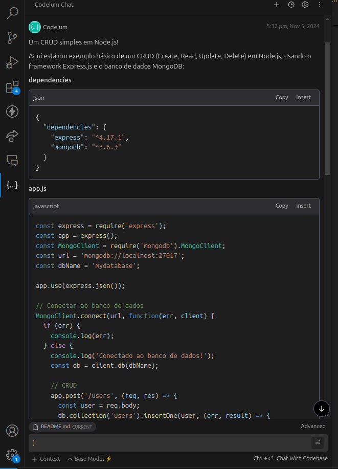
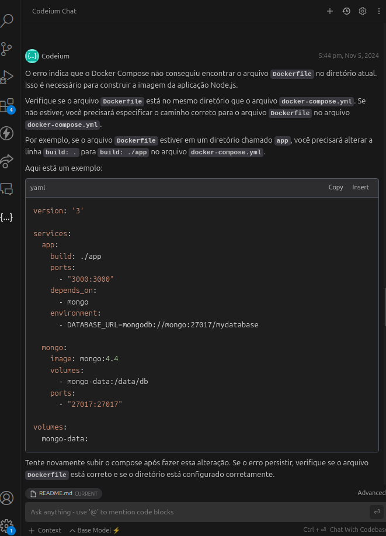

# Atividade: Uso de Assistentes de Código com IA no Ciclo de Vida de Desenvolvimento

## Ferramenta Escolhida: Codium

### 1. Justificativa da Escolha
A escolha da Codium se deu pelo fato de ela oferecer uma versão gratuita, sendo acessível para estudantes, além de estar posicionada no quadrante de desafiadoras do Gartner para Assistentes de Código com IA. Codium se destaca por seu foco em chat, interação com o desenvolvedor e geração de código, o que facilita o processo de automação no ciclo de vida de desenvolvimento.

### 2. Configuração do Ambiente
A ferramenta foi configurada no ambiente de desenvolvimento **VSCODE**, com as seguintes etapas:
- Instalação do plugin/extensão Codium na IDE.
- Verificação das funcionalidades de integração, como sugestões de código, análise de qualidade e verificação de segurança.

### 3. Tarefas Práticas

#### 3.1 Especificação de Código
Utilizamos a Codium para auxiliar na escrita de uma especificação para uma API CRUD básica. A ferramenta ajudou na geração automática de trechos de código e anotações sobre o comportamento esperado da API.

Segue um print com código de retorno gerado:




**Exemplo de Código Gerado:**
```javascript
const express = require('express');
const app = express();
const MongoClient = require('mongodb').MongoClient;
const url = 'mongodb://localhost:27017';
const dbName = 'mydatabase';

app.use(express.json());

// Conectar ao banco de dados
MongoClient.connect(url, function(err, client) {
  if (err) {
    console.log(err);
  } else {
    console.log('Conectado ao banco de dados!');
    const db = client.db(dbName);

    // CRUD
    app.post('/users', (req, res) => {
      const user = req.body;
      db.collection('users').insertOne(user, (err, result) => {
        if (err) {
          res.status(500).send({ message: 'Erro ao criar usuário' });
        } else {
          res.send({ message: 'Usuário criado com sucesso' });
        }
      });
    });

    app.get('/users', (req, res) => {
      db.collection('users').find().toArray((err, users) => {
        if (err) {
          res.status(500).send({ message: 'Erro ao listar usuários' });
        } else {
          res.send(users);
        }
      });
    });

    app.put('/users/:id', (req, res) => {
      const id = req.params.id;
      const user = req.body;
      db.collection('users').updateOne({ _id: ObjectId(id) }, { $set: user }, (err, result) => {
        if (err) {
          res.status(500).send({ message: 'Erro ao atualizar usuário' });
        } else {
          res.send({ message: 'Usuário atualizado com sucesso' });
        }
      });
    });

    app.delete('/users/:id', (req, res) => {
      const id = req.params.id;
      db.collection('users').deleteOne({ _id: ObjectId(id) }, (err, result) => {
        if (err) {
          res.status(500).send({ message: 'Erro ao deletar usuário' });
        } else {
          res.send({ message: 'Usuário deletado com sucesso' });
        }
      });
    });
  }
});

app.listen(3000, () => {
  console.log('Servidor rodando na porta 3000');
});
```

#### 3.2 Qualidade de Código
A análise de uma base de código existente da disciplina de segurança foi realizada com a Codium, que identificou melhorias de qualidade, como simplificação de métodos e refatoração. A ferramenta sugeriu boas práticas, que foram aplicadas.

##### Sugestão do Codeium

Código utilizado para o codium fazer a analise:

```javascript
const express = require('express');
const app = express();
const pool = require('./db');
const jwt = require('jsonwebtoken');
const cors = require('cors');

app.use(cors());
app.use(express.json());

app.listen(3000, () => {
	console.log('Server started on port 3000');
});

app.post('/api/login', async (req, res) => {
	const { email, password } = req.body;

	try {
		const result = await pool.query(`SELECT * FROM users WHERE email = '${email}' and password = '${password}'`);
		const user = result.rows[0];

		console.log({user});

		if (!result) {
			return res.status(404).send('User not found');
		}

		if (!user || user.password !== password) {
			return res.status(401).send('Invalid credentials');
		}

		res.status(200).send({
			user: result.rows[0],
		});
	} catch (err) {
		console.error(err);
		res.status(500).send('Server Error');
	}
});

app.get('/api/users', async (req, res) => {
	try {
		const result = await pool.query('SELECT * FROM users');

		if (!result) {

			return res.status(404).send('No users found');
		}

		res.json(result.rows);
	} catch (err) {
		console.error(err);
		res.status(500).send('Server Error');
	}
});

app.get('/api/users/:id',async (req, res) => {
	try {
		const { id } = req.params;

		console.log({id});

		const query = `SELECT * FROM users WHERE id = ${id}`;
	
		console.log({query});

		const result = await pool.query(query);

		if (!result) {

			return res.status(404).send('User not found');
		}

		res.json(result.rows);
	} catch (err) {
		console.error(err);
		res.status(500).send('Server Error');
	}
});

app.post('/api/users', async (req, res) => {
	try {
		const { name, email, password } = req.body;

		const user = await pool.query(`SELECT * FROM users WHERE email = '${email}'`);
		
		if (user.email === email) {
		
			return res.status(400).send('User already exists');
		}

		const query = `INSERT INTO users (name, email, password) VALUES ('${name}', '${email}', '${password}') RETURNING *`;
		const result = await pool.query(query);

		res.status(201).json(result.rows[0]);

	} catch (err) {
		console.error(err);
		res.status(500).send('Server Error');
	}
});

app.put('/api/users/:id', async (req, res) => {
	try {
		const { id } = req.params;
		console.log({id});
		const { email, name, password } = req.body;

		const userQuery = `SELECT * FROM users WHERE id = ${id}`;
		const databaseUser = await pool.query(userQuery);
		const user = databaseUser.rows[0];
		const userUpdateQuery = `UPDATE users SET name = '${name}', email = '${email}', password = '${password}' WHERE id = ${user.id} RETURNING *`;
		const result = await pool.query(userUpdateQuery);

		res.json(result.rows[0]);
	} catch (err) {
		console.error(err);
		res.status(500).send('Server Error');
	}
});

app.delete('/api/users/:id', async (req, res) => {
	try {
		const { id } = req.params;

		await pool.query(`DELETE FROM users WHERE id = ${id}`);

		res.status(200).send('User deleted');
	} catch (err) {
		console.error(err);
		res.status(500).send('Server Error');
	}
});
```

Existem várias sugestões que posso fazer para melhorar o seu CRUD em Node.js em termos de refatoração, segurança e boas práticas. Aqui estão algumas delas:

* Refatoração

Separe a lógica de negócios: Em vez de ter todo o código no arquivo server.js, separe a lógica de negócios em arquivos separados, como userController.js, userModel.js, etc.
Use funções: Em vez de ter código inline, use funções para organizar o código e torná-lo mais reutilizável.
Use async/await: Em vez de usar callbacks, use async/await para tornar o código mais legível e fácil de entender.
Segurança

* Use prepared statements: Em vez de concatenar strings para criar queries SQL, use prepared statements para evitar ataques de injeção de SQL.
Use hashing e salting: Em vez de armazenar senhas em texto puro, use hashing e salting para proteger as senhas dos usuários.
Use autenticação e autorização: Implemente autenticação e autorização para garantir que apenas usuários autorizados possam acessar e modificar dados.
Use HTTPS: Use HTTPS para criptografar a comunicação entre o cliente e o servidor.
Boas práticas

* Use um framework: Em vez de criar um servidor Node.js do zero, use um framework como Express.js para tornar o desenvolvimento mais rápido e fácil.
Use um ORM: Em vez de usar queries SQL diretas, use um ORM (Object-Relational Mapping) como Sequelize para tornar a interação com o banco de dados mais fácil e segura.
Use logging: Implemente logging para monitorar o que está acontecendo no servidor e identificar erros.
Use testes: Implemente testes unitários e de integração para garantir que o código está funcionando corretamente.

* Exemplos de código

Aqui estão alguns exemplos de código que ilustram as sugestões acima:

```javascript
// userController.js
const express = require('express');
const router = express.Router();
const UserModel = require('./userModel');

router.post('/login', async (req, res) => {
  const { email, password } = req.body;
  const user = await UserModel.findByEmail(email);
  if (!user || !user.validPassword(password)) {
    return res.status(401).send('Invalid credentials');
  }
  res.status(200).send({ user });
});

module.exports = router;
javascript
CopyInsert
// userModel.js
const { Sequelize, DataTypes } = require('sequelize');
const sequelize = require('./sequelize');

const User = sequelize.define('User', {
  id: {
    type: DataTypes.INTEGER,
    primaryKey: true,
    autoIncrement: true,
  },
  email: {
    type: DataTypes.STRING,
    unique: true,
  },
  password: {
    type: DataTypes.STRING,
  },
});

User.prototype.validPassword = async function(password) {
  const hashedPassword = await this.get('password');
  return await bcrypt.compare(password, hashedPassword);
};

module.exports = User;
javascript
CopyInsert
// server.js
const express = require('express');
const app = express();
const userController = require('./userController');

app.use(cors());
app.use(express.json());

app.use('/api', userController);

app.listen(3000, () => {
  console.log('Server started on port 3000');
});
```

Esses são apenas alguns exemplos de como você pode melhorar o seu CRUD em Node.js. Lembre-se de que a segurança e as boas práticas são fundamentais para criar um aplicativo robusto e escalável.

#### 3.3 Verificação de Segurança
A Codium foi utilizada para identificar possíveis vulnerabilidades, como XSS e SQL Injection. 
A seguir, são listadas as vulnerabilidades detectadas e as correções sugeridas:

Aqui estão as vulnerabilidades que encontrei no código:

**Vulnerabilidades de Segurança**

Injeção de SQL: O código usa concatenação de strings para criar queries SQL, o que permite que um atacante injete código malicioso.
Autenticação fraca: O código não usa hashing e salting para armazenar senhas, o que permite que um atacante obtenha as senhas em texto puro.
Falta de validação de entrada: O código não valida as entradas do usuário, o que permite que um atacante envie dados maliciosos.
Falta de autenticação e autorização: O código não implementa autenticação e autorização, o que permite que qualquer usuário acesse e modifique dados.
Uso de bibliotecas desatualizadas: O código usa bibliotecas desatualizadas, o que pode conter vulnerabilidades conhecidas.

**Vulnerabilidades de Implementação**

Uso de variáveis globais: O código usa variáveis globais, o que pode causar problemas de concorrência e segurança.
Falta de tratamento de erros: O código não trata erros de forma adequada, o que pode causar problemas de segurança e estabilidade.
Uso de funções síncronas: O código usa funções síncronas, o que pode causar problemas de desempenho e segurança.
Falta de logging: O código não implementa logging, o que pode dificultar a detecção de problemas de segurança.

**Vulnerabilidades de Configuração**

Falta de configuração de segurança: O código não implementa configuração de segurança, o que pode permitir que um atacante acesse o sistema.
Uso de portas padrão: O código usa portas padrão, o que pode permitir que um atacante acesse o sistema.
Falta de firewalls: O código não implementa firewalls, o que pode permitir que um atacante acesse o sistema.

**Vulnerabilidades de Desenvolvimento**

Falta de testes: O código não implementa testes, o que pode permitir que vulnerabilidades passem despercebidas.
Falta de revisão de código: O código não implementa revisão de código, o que pode permitir que vulnerabilidades passem despercebidas.
Uso de práticas de desenvolvimento ruins: O código usa práticas de desenvolvimento ruins, o que pode permitir que vulnerabilidades sejam introduzidas.

Essas são apenas algumas das vulnerabilidades que encontrei no código. É importante lembrar que a segurança é um processo contínuo e que é necessário realizar auditorias e testes regulares para garantir a segurança do sistema.

#### 3.4 Programação Assistida
Codium foi utilizada para criar um novo recurso de crud de usuário sem autenticação via API. **O que pode observar é o codigo gerado por ele não segue as própias melhorias que ele sugere quando é perguntado sobre melhorias no código.**

#### 3.5 Criação de Pipeline de CI/CD
Foi configurado um pipeline de CI/CD automático, incluindo as etapas de build, teste e deploy. A Codium gerou configurações automáticas para parte do processo, auxiliando na automação do deploy.

**Configuração do Pipeline:**
```yml
version: 2.1

jobs:
  build-and-test:
    docker:
    - image: circleci/node:14

    steps:
    - checkout
    - run: npm install
    - run: npm run build
    - run: npm run test

  deploy:
    docker:
    - image: circleci/node:14

    steps:
    - checkout
    - run: npm install
    - run: npm run build
    - run: npm run deploy

workflows:
  version: 2
  build-and-deploy:
    jobs:
    - build-and-test
    - deploy:
        requires:
        - build-and-test
        filters:
          branches:
            only: main
```

### 4. Resultados Obtidos
Documentamos as principais observações em cada etapa:
- **Especificação de Código:** A ferramenta facilitou a geração inicial, economizando tempo.
- **Qualidade de Código:** Foram aplicadas sugestões de refatoração que melhoraram a legibilidade e eficiência.
- **Segurança:** A Codium foi eficaz em detectar vulnerabilidades comuns e propor correções.
- **Programação Assistida:** O código gerado foi útil, mas exigiu algumas adaptações manuais para melhor adequação ao projeto.
    - **Vai ter retrabalho para o código que ele mesmo fez.** 
- **Pipeline de CI/CD:** A ferramenta simplificou a configuração inicial, automatizando o processo de deploy com eficiência.

### 5. Benefícios e Limitações da Ferramenta
- **Benefícios:** Automação de tarefas repetitivas, detecção de vulnerabilidades, geração de código e sugestões de melhorias.
- **Limitações:** Algumas sugestões geradas exigem revisão manual para adequação ao contexto do projeto e tambem correção manual nem sempre os códigos gerados por ele são os melhores e com as melhores práticas.

### 6. Reflexão Crítica
O uso da Codium demonstrou um aumento significativo na produtividade, especialmente na fase de verificação de segurança e programação assistida. No entanto, percebemos a necessidade de revisão e ajuste do código gerado em certos cenários, o que ressalta a importância de uma supervisão humana contínua.

### 7. Conclusão

A Codium oferece uma excelente solução para automação de tarefas no ciclo de vida de desenvolvimento, com um foco em produtividade e segurança. O uso desta ferramenta pode auxiliar equipes de desenvolvimento a melhorar a qualidade e a segurança de seus projetos, desde que o código gerado seja revisado e ajustado conforme necessário.
